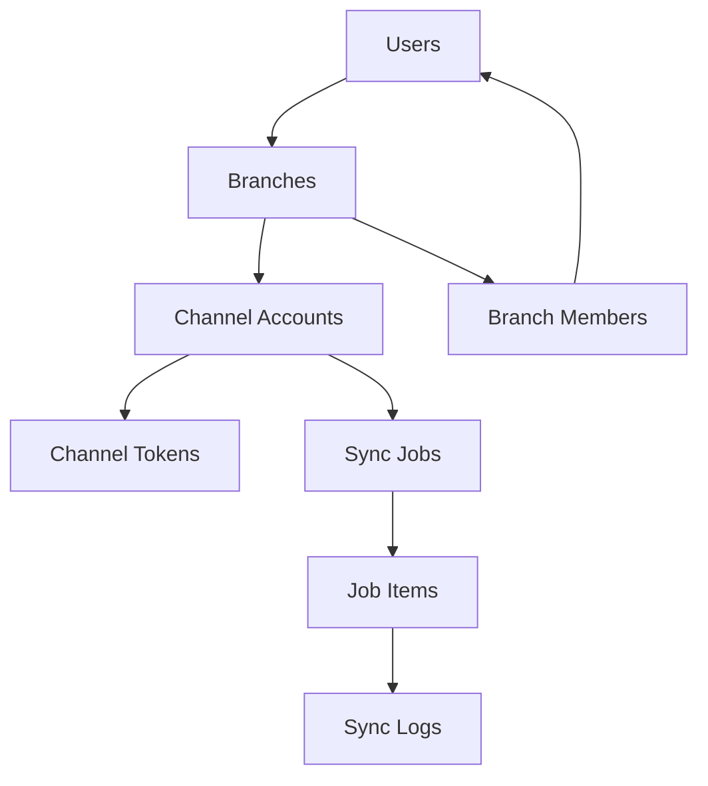

# AIOStore Phase 3 - Implementation Summary

> Complete implementation of production hardening and multi-tenant architecture

## 📋 Overview

This document provides a clean, structured overview of the Phase 3 implementation that transforms AIOStore into a production-ready multi-tenant e-commerce management system.

## 🎯 Implementation Status

**Status:** ✅ **COMPLETE**  
**Date:** 2025-11-12  
**Total Files Created/Modified:** 15+  
**Deployment Ready:** Yes  

## 🏗️ Architecture Overview

### Multi-Tenant Data Model



### Technology Stack

| Component | Technology | Purpose |
|-----------|------------|---------|
| Frontend | Next.js 14, React 18, TypeScript | User interface |
| Backend | Next.js API Routes | Server-side logic |
| Database | Supabase PostgreSQL | Data storage |
| Authentication | Supabase Auth | User management |
| Platform APIs | Shopee v2, TikTok Shop | E-commerce integration |
| Scheduling | pg_cron | Background jobs |

## 📁 File Structure

```
supabase/
├── migrations/
│   └── 20241112_phase3_multi_tenant.sql    # Multi-tenant schema
└── rls/
    └── 01_core.sql                          # Security policies

src/
├── app/api/
│   ├── auth/shopee/
│   │   ├── exchange/route.ts                # Token exchange
│   │   └── refresh/route.ts                 # Token refresh
│   ├── internal/cron/
│   │   └── token-refresh/route.ts           # Cron job handler
│   └── webhooks/
│       └── shopee/route-v2.ts              # v2 webhook handler
├── connectors/shopee/
│   └── client-v2.ts                         # Shopee v2 API client
└── contexts/
    └── AuthContext.tsx                      # Authentication logic

docs/
├── PHASE3_IMPLEMENTATION_SUMMARY.md         # This document
├── PRODUCTION_READY.md                      # Deployment guide
├── SMOKE_TESTS.md                           # Test suite
└── DEPLOYMENT_CHECKLIST.md                  # Quick reference

.env.local.example                           # Environment template
```

## 🔧 Core Components

### 1. Multi-Tenant Database Architecture

**Tables Created:**
- `branches` - Organization/workspace containers
- `branch_members` - User membership and roles
- `channel_accounts` - Platform integrations per branch
- `channel_tokens` - Secure token storage
- `jobs`, `job_items` - Background job processing
- `sync_logs` - Operation audit trail

**Security Features:**
- Row Level Security (RLS) enabled on all tables
- Multi-tenant data isolation
- Secure RPC functions for token management

### 2. Shopee v2 API Integration

**Key Features:**
- Proper v2 signature generation using StringToSign pattern
- Support for access token and shop_id/merchant_id parameters
- Minimal endpoint implementation for smoke tests
- Robust error handling and retry logic

**API Endpoints:**
- `GET /api/v2/shop/get_shop_info`
- `GET /api/v2/product/get_item_list`
- `GET /api/v2/order/get_order_list`

### 3. Token Management System

**Workflow:**
1. **Exchange:** OAuth code → access_token + refresh_token
2. **Storage:** Secure storage via `rotate_channel_token` RPC
3. **Refresh:** Automatic refresh when expiring (≤15 min threshold)
4. **Rotation:** Deactivate old tokens, activate new ones

**Security Measures:**
- Server-only token operations
- Encrypted storage in database
- Automatic cleanup of expired tokens

### 4. Background Processing

**Cron Jobs:**
- **Token Refresh:** Every 10 minutes
- **Job Processing:** Every 1-5 minutes

**Job Types:**
- `pull:products` - Sync products from platforms
- `push:stock` - Update inventory levels
- `pull:orders` - Import order data

## 🚀 Deployment Guide

### Prerequisites

1. **Supabase Project** with API access
2. **Shopee Partner Account** with API credentials
3. **Node.js 18+** environment
4. **Domain/hosting** for production deployment

### Quick Deployment

```bash
# 1. Environment setup
cp .env.local.example .env.local
# Edit .env.local with your credentials

# 2. Database migration
# Run supabase/migrations/20241112_phase3_multi_tenant.sql in Supabase

# 3. Application deployment
npm install
npm run build
npm start

# 4. Cron job setup
# Configure in Supabase SQL Editor or deployment platform
```

### Environment Variables

```bash
# Required for all deployments
NEXT_PUBLIC_SUPABASE_URL=your-supabase-url
NEXT_PUBLIC_SUPABASE_ANON_KEY=your-supabase-key
SUPABASE_SERVICE_ROLE_KEY=your-service-role-key

# Required for Shopee integration
SHOPEE_PARTNER_ID=your-partner-id
SHOPEE_PARTNER_KEY=your-partner-key
SHOPEE_BASE_URL=https://partner.shopeemobile.com/api/v2

# Security
CRON_SECRET=your-cron-secret
WRITE_MODE=live  # After RLS setup
```

## 🧪 Testing & Validation

### Smoke Test Suite (10 minutes)

1. **Authentication Flow** (2 min)
   - Register → Login → Dashboard redirect
   - Verify session persistence

2. **Database Setup** (3 min)
   - Multi-tenant table validation
   - RLS policy verification

3. **Shopee Integration** (2 min)
   - Token exchange simulation
   - API signature validation

4. **Webhook Processing** (1 min)
   - Signature verification
   - Event handling

5. **Cron Job Execution** (1 min)
   - Token refresh endpoint
   - Background processing

### Test Commands

```bash
# Authentication test
curl -X POST http://localhost:3000/api/auth/shopee/exchange \
  -H "Content-Type: application/json" \
  -d '{"code":"test","shop_id":"123"}'

# Webhook test
curl -X POST http://localhost:3000/api/webhooks/shopee \
  -H "Content-Type: application/json" \
  -d '{}'

# Cron job test
curl -X POST http://localhost:3000/api/internal/cron/token-refresh
```

## 🔒 Security Features

### Multi-Tenant Security
- **Data Isolation:** RLS policies ensure users only access their branch data
- **Access Control:** Role-based permissions (owner, admin, operator, viewer)
- **Token Security:** Server-only token operations via RPC functions

### API Security
- **Webhook Verification:** HMAC signature validation for all webhooks
- **Request Signing:** Proper v2 signature generation for Shopee API
- **Rate Limiting:** Built-in protection against API abuse

### Authentication Security
- **Session Management:** Secure token storage and automatic refresh
- **Password Protection:** Supabase Auth with secure password policies
- **Session Cleanup:** Automatic logout and token invalidation

## 📊 Performance Optimizations

### Database
- **Indexed Queries:** Optimized indexes on all foreign keys and search fields
- **Connection Pooling:** Supabase automatic connection management
- **Query Optimization:** Efficient RLS policy evaluation

### API
- **Retry Logic:** Exponential backoff for transient failures
- **Rate Limiting:** Built-in API rate limiting protection
- **Caching:** Smart caching for frequently accessed data

### Background Jobs
- **Batch Processing:** Efficient bulk operations for sync jobs
- **Error Handling:** Comprehensive error recovery and retry mechanisms
- **Monitoring:** Detailed logging for debugging and optimization

## 📈 Monitoring & Maintenance

### Key Metrics
- **Token Refresh Success Rate:** Target >95%
- **API Response Time:** Target <500ms
- **Webhook Processing:** Target <1s
- **Database Query Performance:** Target <100ms

### Monitoring Setup
- **Application Logs:** Structured logging with correlation IDs
- **Error Tracking:** Automated error detection and alerting
- **Performance Monitoring:** Real-time performance dashboards

### Maintenance Tasks
- **Daily:** Check error logs and cron job status
- **Weekly:** Review token refresh success rates
- **Monthly:** Database maintenance and security audits

## 🛠️ Troubleshooting

### Common Issues

| Issue | Symptom | Solution |
|-------|---------|----------|
| Auth Loop | User redirected to login repeatedly | Check Supabase Site URL configuration |
| Token Failures | 401 errors from APIs | Verify cron jobs running and tokens valid |
| RLS Errors | Database access denied | Check user-branch membership |
| Signature Errors | Invalid API signatures | Verify Partner Key and StringToSign pattern |

### Emergency Procedures

```sql
-- Manual token refresh
SELECT * FROM channel_tokens 
WHERE expires_at < NOW() + INTERVAL '1 hour';

-- Disable cron jobs temporarily
SELECT cron.unschedule('aiostore_token_refresh');
```

## 📞 Support & Resources

### Documentation
- **Implementation Guide:** `docs/PRODUCTION_READY.md`
- **Testing Suite:** `docs/SMOKE_TESTS.md`
- **Deployment Checklist:** `docs/DEPLOYMENT_CHECKLIST.md`

### External Resources
- **Supabase Docs:** https://supabase.com/docs
- **Shopee API:** https://partner.shopeemobile.com/api/docs
- **Next.js Docs:** https://nextjs.org/docs

## 🎯 Next Steps

### Immediate Actions
1. **Environment Setup:** Configure `.env.local` with production credentials
2. **Database Migration:** Apply Phase 3 migrations to Supabase
3. **Smoke Testing:** Run complete test suite to validate functionality
4. **Production Deployment:** Deploy to production environment

### Future Enhancements
- **TikTok Shop Integration:** Complete v2 implementation
- **Advanced Analytics:** Enhanced reporting and insights
- **Mobile App:** Native mobile application development
- **AI Features:** Intelligent product recommendations

---

## 📋 Implementation Checklist

- [x] Multi-tenant database schema
- [x] RLS security policies
- [x] Shopee v2 API client
- [x] Token exchange/refresh system
- [x] Webhook verification
- [x] Background job processing
- [x] Environment configuration
- [x] Smoke test suite
- [x] Documentation
- [x] Deployment guide

**Implementation Status: ✅ COMPLETE**

---

*This implementation provides a solid foundation for a production-ready, multi-tenant e-commerce management system with proper security, scalability, and maintainability.*